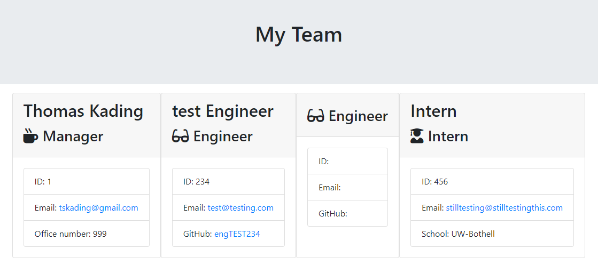

# Template-Engine-Employee-Summary
Node CLI that takes in information about employees and generates an HTML webpage that displays summaries for each person.

# Installation 
First: Clone down the repo from my Github - [tskading.](https://github.com/Tskading/Template-Engine-Employee-Summary)

Second: Run 'npm i' in your intergrated terminal to get necessary files and pagkages installed.

Third: run the command 'node app.js' in your terminal to start the command prompt.  

Fourth: Have fun creating your team!

## Link and Screenshots
[This link will take you to a demo/walkthrough video](https://drive.google.com/file/d/1pk2oST8KONIvUfoIQ63lLthD6VR7pbye/view)

